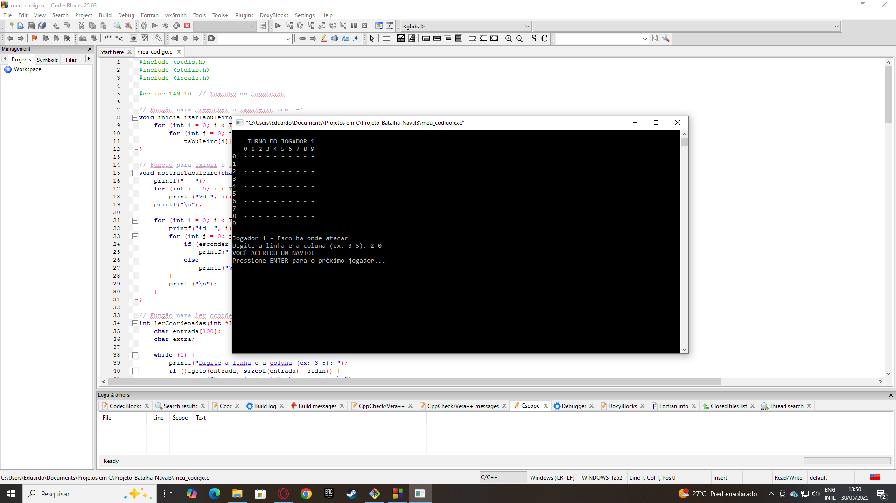

#  Jogo de Batalha Naval em C

Projeto desenvolvido para praticar lógica de programação e estrutura modular em linguagem C.

##  Descrição
Este é um jogo de Batalha Naval no terminal para dois jogadores.  
Cada jogador posiciona 5 navios em um tabuleiro 10x10 e se alternam tentando acertar a localização dos navios do oponente.  
O jogo termina quando todos os navios de um jogador forem destruídos.  
Ao final, é possível jogar novamente com a opção de revanche.

##  Funcionalidades

- Interface de texto simples
- Validação robusta das entradas
- Alternância de jogadores
- Ocultação dos navios do oponente
- Sistema de repetição com "Deseja jogar novamente?"
- Compatível com Windows e Linux (limpeza de tela adaptada)

##  Aprendizados

- Leitura segura com `fgets` e `sscanf`
- Manipulação de matriz bidimensional
- Estruturação com funções
- Compatibilidade cross-platform com `#ifdef _WIN32`
- Controle de fluxo com `do...while`

##  Exemplo (print)



```bash
Digite a linha e a coluna (ex: 3 5): 2 0
VOCÊ ACERTOU UM NAVIO!
Pressione ENTER para o próximo jogador...
```

